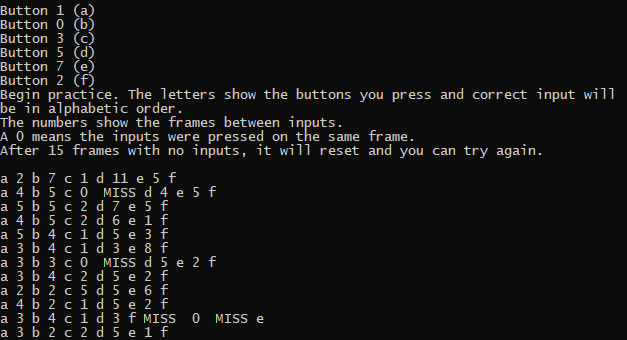

# Piano Tutor
Use this tool to analyze and optomize [pianoing](http://iplaywinner.com/glossary/inputs-technique/piano.html) buttons. Easily configure any sequence of button presses, then get feedback on frames between presses and button order. A pre-built Windows exe is included in the repo.

It may be helpful to run this tool and play a game in a window at the same time, but keep in mind that drivers update to reflect joystick input state at random times. The game and Piano Tutor may receive inputs on different frames.

# Dependencies
[SDL](https://www.libsdl.org/) (SDL2.dll is included in the repo)

# Building
Windows: edit build.bat with your directories for SDL header and lib files. Run build.bat from a visual studio command line.
OSX/Linux: should work, but I haven't tested it. The code is "cross platform," but this is C++ so that doesn't mean much.

# License
MIT
